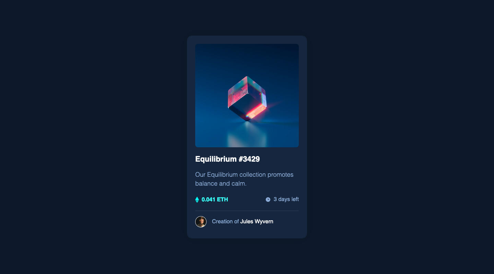

# **NFT preview card component solution**

This is a solution to the [NFT preview card component challenge on Frontend Mentor](https://www.frontendmentor.io/challenges/nft-preview-card-component-SbdUL_w0U).

## **Table of contents**

- [Screenshot](#screenshot)
- [Links](#links)
- [Built with](#built-with)
- [Author](#author)

## **Screenshot**

## **Links**

- [Solution URL](https://github.com/ionStici/nft-preview-card-component)
- [Live Site URL](https://ionstici.github.io/nft-preview-card-component)

## **Built with**

- Semantic HTML5 markup
- CSS custom properties
- Flexbox and CSS Grid

## **Author**

- GitHub - [@ionStici](https://github.com/ionStici)
- Frontend Mentor - [@ionStici](https://www.frontendmentor.io/profile/ionStici)
- Twitter - [@IonStici3](https://twitter.com/IonStici3)

<!-- ## **Styles**

- Soft blue: hsl(215, 51%, 70%)
- Cyan: hsl(178, 100%, 50%)
- Very dark blue (main BG): hsl(217, 54%, 11%)
- Very dark blue (card BG): hsl(216, 50%, 16%)
- Very dark blue (line): hsl(215, 32%, 27%)
- White: hsl(0, 0%, 100%)
- Family: [Outfit](https://fonts.google.com/specimen/Outfit)
- Font size (paragraph): 18px
- Weights: 300, 400, 600 -->
